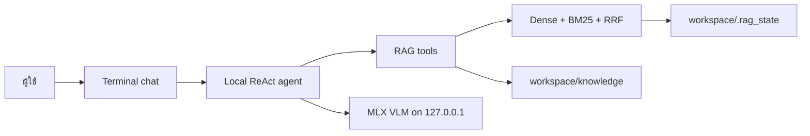

# ENDEAVOR_RAG

ผู้ช่วย RAG แบบ local-first สำหรับค้นเอกสารภาษาไทยและภาษาอังกฤษบน Mac Apple
Silicon โดยข้อมูลเอกสารและดัชนีอยู่ในเครื่องของคุณเอง

โปรเจกต์นี้เหมาะกับการถามว่า “ในเอกสารของฉันพูดถึงเรื่องนี้ว่าอย่างไร”
รองรับการ ingest Markdown, text, PDF, CSV และ JSON แล้วค้นด้วย dense
embeddings + BM25 + RRF ก่อนให้ local model ช่วยเลือก context และสรุปคำตอบ

โปรเจกต์นี้ไม่ใช่ web-search agent, ไม่ส่งเอกสารให้ cloud LLM และไม่ใช่
เครื่องมืออ่าน filesystem ทั้งเครื่อง การค้นหาเริ่มจาก
`workspace/knowledge/` ที่ผู้ใช้กำหนดไว้เท่านั้น

## ความสามารถ

- Thai-aware chunking พร้อม context parent/child
- Dense retrieval ด้วย `paraphrase-multilingual-MiniLM-L12-v2`
- BM25 ที่ตัดคำไทยด้วย `pythainlp`
- RRF fusion และ local LLM reranking
- Terminal chat ภาษาไทย พร้อมเครื่องมือค้นหาไฟล์ อ่านไฟล์ และบันทึก memory
- Chroma/BM25 health check และ index ที่สร้างซ้ำต่อได้
- Local MLX VLM server ที่ bind กับ `127.0.0.1` เท่านั้น

## ความต้องการของระบบ

- macOS บน Apple Silicon (`arm64`)
- Python 3.11
- พื้นที่ดิสก์สำหรับ Python packages, embedding model และ LLM model
- อินเทอร์เน็ตครั้งแรกสำหรับติดตั้ง packages และดาวน์โหลด model ที่เลือก

โมเดลเริ่มต้นคือ
[`mlx-community/Qwen3.5-2B-OptiQ-4bit`](https://huggingface.co/mlx-community/Qwen3.5-2B-OptiQ-4bit)
น้ำหนักโมเดลไม่ได้อยู่ใน repository และจะดาวน์โหลดเมื่อเปิด MLX server ครั้งแรก
โปรดตรวจ license ของโมเดลและ dependencies ก่อนใช้งานเชิงพาณิชย์

## ติดตั้งแบบเร็ว

```bash
bash install_library/install.sh
source .venv/bin/activate
python tools/doctor.py
```

Installer จะตรวจ macOS/Apple Silicon, สร้าง `.venv` ของโปรเจกต์นี้ และติดตั้ง
dependency ที่ lock พร้อม hash โดยจะไม่เปิด server, ไม่โหลด model และไม่สแกน
เอกสารของคุณ

วางเอกสารไว้ใต้ `workspace/knowledge/` แล้วสร้างดัชนี:

```bash
python tools/build_index.py
```

จากนั้นเปิด agent:

```bash
python main.py
```

การรัน `main.py` จะเปิด local MLX server ที่ port `8092` ให้เองถ้ายังไม่ทำงาน
หรือเปิดเองใน Terminal แรกได้:

```bash
python -m mlx_vlm.server \
  --model mlx-community/Qwen3.5-2B-OptiQ-4bit \
  --host 127.0.0.1 --port 8092 --api-key x \
  --prefill-step-size 512
```

แล้วใช้ `python main.py` ใน Terminal ที่สอง

## การทำงานโดยย่อ



ดัชนี, BM25 pickle, file registry, logs และ memory ถูกเก็บใน
`workspace/.rag_state/` ซึ่งถูก ignore โดย Git เอกสารจริงของผู้ใช้ก็ถูก ignore
เช่นกัน

## การตั้งค่า

ค่าทั้งหมดเป็น environment variables และไม่จำเป็นต้องแก้ source code:

| ตัวแปร | ค่าเริ่มต้น | ความหมาย |
|---|---|---|
| `RAGMAX_WORKSPACE` | `workspace/` | workspace หลักของโปรเจกต์ |
| `RAGMAX_KNOWLEDGE_DIR` | `workspace/knowledge/` | root ของเอกสารที่จะ index |
| `RAGMAX_STATE_DIR` | `workspace/.rag_state/` | Chroma, BM25, registry, logs และ memory |
| `RAGMAX_MLX_HOST` | `127.0.0.1` | host ของ local server |
| `RAGMAX_MLX_PORT` | `8092` | port ของ local server |
| `RAGMAX_MLX_MODEL` | model ID ด้านบน | model ที่ใช้ตอบและ rerank |
| `RAGMAX_MLX_API_KEY` | `x` | local transport key; อย่าเปิด server ออก LAN |
| `RAGMAX_MLX_PYTHON` | `.venv/bin/python` | Python ที่ใช้เปิด `mlx_vlm.server` |
| `RAGMAX_MLX_PREFILL_STEP_SIZE` | `512` | prefill step ของ MLX server |
| `RAGMAX_NO_AUTO_START` | ไม่ตั้งค่า | ตั้งเป็น `1` เพื่อไม่ให้ `main.py` spawn server |

ตัวอย่างย้ายเอกสารและ state ไปยังดิสก์อื่น:

```bash
export RAGMAX_WORKSPACE="$PWD/my_rag_workspace"
export RAGMAX_KNOWLEDGE_DIR="$RAGMAX_WORKSPACE/knowledge"
export RAGMAX_STATE_DIR="$RAGMAX_WORKSPACE/.rag_state"
python tools/build_index.py
```

แม้กำหนด path เอง ระบบจะปฏิเสธ source ที่หลุดออกนอก knowledge root รวมถึง
symlink/path traversal เพื่อไม่บันทึก absolute path ของไฟล์ที่อยู่นอกขอบเขต

## ตรวจสอบและทดสอบ

คำสั่ง doctor เป็น read-only และไม่เปิด model:

```bash
python tools/doctor.py
python tools/doctor.py --check-server
```

รัน deterministic regression tests:

```bash
python -m pytest tests -q
```

ชุดทดสอบใช้ temporary state และ fake embeddings จึงไม่ดาวน์โหลด model และไม่
แตะ index ของผู้ใช้ การทดสอบ live model เป็นขั้นตอนแยกต่างหากและต้องเปิด server
ด้วยตนเอง

## ความเป็นส่วนตัวและข้อจำกัด

- Local UI และ MLX server bind กับ `127.0.0.1`; อย่าเปลี่ยนเป็น `0.0.0.0`
  หากไม่เข้าใจผลด้านความปลอดภัย
- เอกสาร, path, index และ memory อยู่ในเครื่องและไม่ถูกส่งให้ hosted LLM โดย
  source นี้
- Model ขนาดเล็กอาจสรุปผิดหรือเลือก tool ผิด ควรตรวจคำตอบสำคัญกับเอกสารต้นฉบับ
- ห้ามใส่ credentials, private keys, session files หรือข้อมูลส่วนตัวที่ไม่จำเป็น
  ลงใน prompt, issue หรือ repository

## License และการร่วมพัฒนา

โปรเจกต์เผยแพร่ภายใต้ MIT License สำหรับ source ของโปรเจกต์นี้ ดู
[`LICENSE`](LICENSE), [`SECURITY.md`](SECURITY.md) และ
[`CONTRIBUTING.md`](CONTRIBUTING.md) ก่อนใช้งานหรือส่งการเปลี่ยนแปลง
