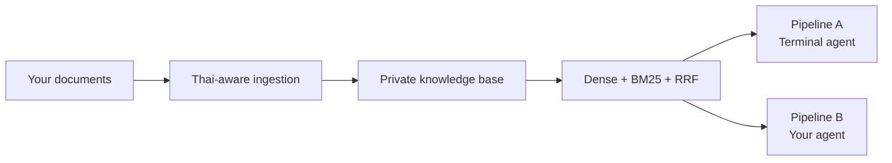

# ENDEAVOR_RAG

ค้นหาความรู้ของคุณให้พบ — ด้วย RAG ภาษาไทยและอังกฤษที่ทำงานบน Mac ของคุณเอง

ENDEAVOR_RAG เปลี่ยนโฟลเดอร์เอกสารส่วนตัวให้เป็น knowledge base ที่พร้อมตอบคำถาม
อย่างมีบริบท ไม่ว่าจะเป็นนโยบายบริษัท โน้ตวิจัย คู่มือการทำงาน รายงาน PDF หรือ
ข้อมูล CSV/JSON ทุกอย่างตั้งแต่เอกสาร ดัชนี ไปจนถึง model server ทำงานแบบ
local-first บน Apple Silicon

สร้างครั้งเดียว แล้วเลือกใช้ได้สองแบบจาก knowledge base เดียวกัน:

- **Pipeline A — Chat with your knowledge:** เปิด Terminal agent เพื่อถาม ค้นหา
  เปิดอ่านไฟล์ และบันทึกสิ่งที่อยากจำ
- **Pipeline B — Bring RAG to your agent:** ให้ agent ที่คุณสร้างเองเรียก
  `rag_search` และ tools ของ ENDEAVOR_RAG เพื่อใช้ retrieval ที่พร้อมอยู่ในงานของคุณ

## Why ENDEAVOR_RAG

- **สร้างมาเพื่อภาษาไทยและอังกฤษ** — Thai-aware chunking, multilingual embeddings
  และ BM25 ที่ตัดคำไทย
- **ค้นหาอย่างมีหลักฐาน** — ผสาน dense retrieval กับ BM25 ผ่าน Reciprocal Rank
  Fusion (RRF) ก่อนคืน context พร้อม source
- **ข้อมูลอยู่กับคุณ** — knowledge root, index, logs และ memory อยู่ในเครื่อง
- **ใช้ได้ทั้งคนและ agent** — เริ่มจาก Terminal ได้ทันที หรือนำ tool ไปต่อกับ
  LangGraph/LangChain agent ของคุณ
- **ดูแล index ได้ง่าย** — สร้างซ้ำได้, ตรวจสุขภาพได้, และ sync เอกสารที่เพิ่ม
  เปลี่ยน หรือลบออกได้



## Get started

ENDEAVOR_RAG ต้องการ macOS บน Apple Silicon และ Python 3.11

```bash
bash install_library/install.sh
source .venv/bin/activate
python tools/doctor.py
```

วางเอกสาร `.md`, `.txt`, `.pdf`, `.csv` หรือ `.json` ไว้ใน
`workspace/knowledge/` แล้วสร้าง index:

```bash
python tools/build_index.py
```

จากนั้นเลือก workflow ที่เหมาะกับคุณ

## Pipeline A — Your private knowledge assistant

เปิด agent แล้วเริ่มคุยกับเอกสารของคุณได้ทันที:

```bash
python main.py
```

Pipeline A เป็น Terminal ReAct agent ที่ใช้ local MLX model และเลือก tool ให้ตาม
เจตนาของคำถาม:

| คุณอยากทำอะไร | Agent ใช้อะไร |
|---|---|
| ถามเนื้อหาในเอกสาร | `rag_search` |
| ดูภาพรวม knowledge base | `list_knowledge` |
| หาเอกสารจากชื่อไฟล์ | `search_files` |
| เปิดอ่านเอกสาร | `read_file` |
| บันทึกสิ่งที่อยากจำ | `save_memory` |

เมื่อเริ่ม `main.py` ระบบจะเตรียม embedding model และ local MLX server ให้พร้อมใช้
บน `127.0.0.1:8092` ตามค่าตั้งต้น

## Pipeline B — Retrieval for the agent you already have

มี agent ของตัวเองอยู่แล้ว? นำ ENDEAVOR_RAG เข้าไปเป็น knowledge tool ได้โดยตรง
Pipeline B ให้คุณใช้ retrieval pipeline เดียวกับ Pipeline A ใน LangGraph หรือ
LangChain workflow ของคุณ พร้อม query expansion, dense search, Thai BM25, RRF,
parent-context retrieval และ local reranking

```python
from langgraph.prebuilt import create_react_agent

from llm_client import build_llm
from rag_search import rag_search

agent = create_react_agent(
    build_llm(),
    tools=[rag_search],
    prompt=(
        "Search the local knowledge base when needed. "
        "Answer from returned context and cite its sources."
    ),
)

result = agent.invoke({
    "messages": [{"role": "user", "content": "สรุปนโยบายการลาคืออะไร"}]
})
```

หรือให้ orchestrator เรียก retrieval tool โดยตรง:

```python
from rag_search import rag_search

context = rag_search.invoke({"query": "เงื่อนไขการลางาน"})
print(context)
```

`rag_search` คืน parent context ที่เกี่ยวข้องพร้อม `SOURCES:` ให้ agent ของคุณ
นำไปสังเคราะห์คำตอบต่อได้อย่างโปร่งใส คุณยังเลือกเพิ่ม `list_knowledge`,
`search_files`, `read_file` และ `save_memory` เป็น tools ของ agent ได้ตาม workflow

## Built for your documents

เอกสารทุกชิ้นอยู่ใต้ knowledge root ที่คุณกำหนด และระบบเก็บ runtime state แยกไว้ที่
`workspace/.rag_state/`:

- Chroma vector index
- BM25 index
- file registry และ index health data
- local logs และ persistent memory

การสร้าง index ซ้ำจะจัดการไฟล์ที่เปลี่ยนแปลงให้โดยอัตโนมัติ คุณจึงอัปเดต knowledge
base ได้ต่อเนื่องโดยใช้คำสั่งเดิม:

```bash
python tools/build_index.py
```

## Configure your workspace

กำหนดทุกอย่างผ่าน environment variables โดยไม่ต้องแก้ source code:

| ตัวแปร | ค่าเริ่มต้น | ใช้สำหรับ |
|---|---|---|
| `RAGMAX_WORKSPACE` | `workspace/` | workspace หลัก |
| `RAGMAX_KNOWLEDGE_DIR` | `workspace/knowledge/` | โฟลเดอร์เอกสาร |
| `RAGMAX_STATE_DIR` | `workspace/.rag_state/` | index, registry, logs และ memory |
| `RAGMAX_MLX_HOST` | `127.0.0.1` | local MLX server |
| `RAGMAX_MLX_PORT` | `8092` | port ของ MLX server |
| `RAGMAX_MLX_MODEL` | Qwen3.5-2B-OptiQ-4bit | model สำหรับตอบและ rerank |
| `RAGMAX_NO_AUTO_START` | ไม่ตั้งค่า | ควบคุมการเปิด server อัตโนมัติ |

ตัวอย่าง workspace บนดิสก์อื่น:

```bash
export RAGMAX_WORKSPACE="$PWD/my_rag_workspace"
export RAGMAX_KNOWLEDGE_DIR="$RAGMAX_WORKSPACE/knowledge"
export RAGMAX_STATE_DIR="$RAGMAX_WORKSPACE/.rag_state"
python tools/build_index.py
```

## Verify with confidence

```bash
python tools/doctor.py
python tools/doctor.py --check-server
python -m pytest tests -q
```

ชุดทดสอบ deterministic ใช้ temporary state และ fake embeddings จึงรันได้โดยไม่
กระทบ index ของคุณ

## Privacy by design

ENDEAVOR_RAG เก็บเอกสาร paths, index และ memory ไว้ในเครื่อง และ local UI/MLX
server ใช้ `127.0.0.1` ตามค่าเริ่มต้น โปรดเก็บ credentials, private keys และ
ข้อมูลอ่อนไหวออกจาก prompt, issue และ repository

## License and contributing

ENDEAVOR_RAG เผยแพร่ภายใต้ MIT License ดูรายละเอียดที่
[`LICENSE`](LICENSE), [`SECURITY.md`](SECURITY.md) และ
[`CONTRIBUTING.md`](CONTRIBUTING.md)
